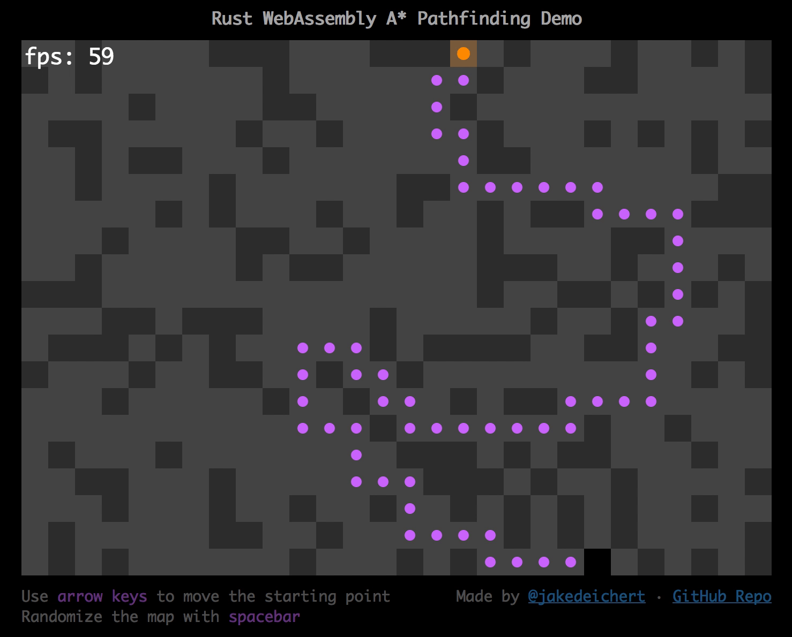

# Rust WebAssembly A* Pathfinding Demo

This is a port of an A* implementation of mine from an old Unity maze project.

Check out the demo [here](https://jacobdeichert.github.io/wasm-astar/)!

## My Experience with WebAssembly and Rust So Far

The last time I tried learning Rust was a few years ago. I've been meaning to try it out again since then, and after hearing about Rust nightly getting the wasm32-unknown-unknown target, it seemed like a great time to do so.

But first, I had to decide what to write! A recent blog post ([Rocket - A Rust game running on WASM](https://aochagavia.github.io/blog/rocket---a-rust-game-running-on-wasm/)) really got me motivated to do something game dev related. I haven't used the canvas api in years, but I've been itching to do something with it once again. I figured that porting a piece of an old Unity project might be a good start, so I decided to go with an A* implementation I wrote for a maze demo.

Now that it's complete, I'll go over some of the interesting parts from my experience so far. Also, at the bottom of this post I have a few questions that I would appreciate answers to!

### The Good Parts

Here's a few things that I really liked about this experience.

#### Very Little JS!

It's been quite a while since I've coded raw js without webpack bundling or babel transpiler processes running in the background. My goal for making this demo was to keep the client-side non-wasm code as simple as possible. This means that you can go into the `dist/` directory and read the raw html, css, and js in only a few minutes. Not needing webpack or babel was so refreshing! Since only evergreen browsers can run wasm, I could use the latest js features without worrying about whether it would work in older browsers. With that said... if I started a project larger than a demo or needed npm libraries (like threejs) I would most likely grab my webpack boilerplate project and be on my way.

Another goal of mine was to keep as much logic as possible on the wasm side. The js file is very minimal and contains mostly canvas api and rendering functions for Rust to bridge to. Take a [look](https://github.com/jacobdeichert/wasm-astar/blob/5089f7ec663938c7bdeb178c357e111621ce3551/dist/main.js) for yourself!

#### I Learned Some Rust!

I find the best way to learn a language is to build something with it. I haven't even read the second edition of the book yet, but did skim a few pages as needed. The Rust docs are also extremely well done.

After completing this demo, I can say that my next side project is definitely going to incorporate some Rust. I am loving this language!

#### Bridging JS and WebAssembly is Too Easy

After reading the source code of [rocket_wasm](https://github.com/aochagavia/rocket_wasm), it was really easy to pick up on how js and wasm communicate.

And with great power comes great responsibility. The last thing you want to do is spread dozens of js calls all over your Rust code. I decided to go overly explicit and prepend all js function names with `js_`. For example: `js_clear_screen`, `js_set_screen_size`, `js_request_tick`. This makes them really easy to grep in your Rust source. The next thing I did was wrap most of those calls within Rust modules. One reason I did that is because every time you call a js function, you must wrap the call point in an `unsafe` block. By wrapping those into modules, it provides a safe interface to that small chunk of unsafe code. Check out the [browser module](https://github.com/jacobdeichert/wasm-astar/blob/46b5dbb7d108fe1cb8fdb9cb77ec6c7d583fbca9/src/browser/mod.rs) for an example.

### Growing Pains

Here's a few issues I ran into and the workarounds I applied.

#### Where to Store Game State

Since I am pretty new to Rust, I wasn't exactly sure how or where to store global game state. Global scoped variables are not ideal of course, but for a small demo it shouldn't be a problem. One goal of mine was to keep as much logic as possible on the Rust side instead of in js land. I also didn't want to send the game state back and forth between js and Rust every tick since that seems like absolute overkill. With that said, it seemed like I must store the game state in a global Rust variable. After reading through the `rocket_wasm` source code, I copied their [global state pattern](https://github.com/aochagavia/rocket_wasm/blob/d0ca51beb9c7c351a1f0266206edfd553bf078d3/src/lib.rs#L23-L25).

~~~rust
lazy_static! {
    static ref WORLD_STATE: Mutex<WorldState> = Mutex::new(WorldState::new());
    static ref ENGINE_STATE: Mutex<EngineState> = Mutex::new(EngineState::new());
}
~~~

> [view src](https://github.com/jacobdeichert/wasm-astar/blob/cee849fa6ae54ba187e1a16556ce35ea1698b052/src/lib.rs#L44-L47)

However, this pattern ended up causing a few issues for me that I had to overcome...

#### Mutex Unlocking

With the game state stored as a mutex, I need to lock it each time I want to use it.

As you'll see in the snippet below, I ran into an issue where I accessed `WORLD_STATE` and then called another function which also accessed `WORLD_STATE` too. I ran into this issue the hard way... After the wasm loaded in the client, I'd get this amazingly descriptive error:

> "RuntimeError: unreachable executed"

After disabling some code here and there, I found out where this error was coming from... the mutex locks.

I then learned that mutexes unlock themselves when their scope lifetime ends. With that knowledge, I tried wrapping a part of the logic with curly braces `{ ... }` and put the `initial_draw()` call outside that scope. This worked! The `world` variable dies at the end of its scope and this allows `initial_draw()` to access the `WORLD_STATE` mutex.

Throughout my code, you'll see a bunch of spots where I add extra curly braces. One alternative solution is to pass `world` to each function. I started doing that in some places, but haven't cleaned up the rest yet.

~~~rust
#[no_mangle]
pub extern "C" fn init(debug: i32, render_interval_ms: i32) {
    // Requires block curlies so lifetime of world ends which causes unlock
    // and allows initial_draw() to gain control of the lock.
    // Otherwise, this generic client error occurs: "RuntimeError: unreachable executed"
    {
        let world = &mut WORLD_STATE.lock().unwrap();
        world.debug = if debug == 1 { true } else { false };
        // ...
    }
    initial_draw();
}
~~~

> [view src](https://github.com/jacobdeichert/wasm-astar/blob/cee849fa6ae54ba187e1a16556ce35ea1698b052/src/lib.rs#L56-L77)

#### Mutex Unlocking Part 2

So this one was a little trickier to find at first. When the js side called my Rust `init()` function, if it's in debug mode I wanted to do a slow `setInterval` tick instead of the normal `requestAnimationFrame`. The Rust side kicks off `start_interval_tick()` on the js side. Since the tick is really slow, I didn't have an initial render shown for x amount of seconds. So to get that initial render, I decided to do an immediate tick by calling the Rust `tick()` function.

Then, this wonderful error again:

> "RuntimeError: unreachable executed"

After some fiddly debugging, I realized what was going on. Rust called into js (`start_interval_tick()`) and js called back into Rust (`tick()`) all within the same call stack started from the Rust `init()` function. Since both `init()` and `tick()` code paths access `WORLD_STATE`, `init()` still owned the lock and `tick()` crashed because of that. After I understood that it was due to sharing the same call stack, that meant that `init()` was never finishing and therefor its `WORLD_STATE` reference never unlocked. I simply fixed it by doing an immediate `setTimeout` (0ms) to push that initial `tick()` call onto the end of the js event queue thus having its own call stack.

Here's the fixed version.

~~~js
js_start_interval_tick(ms) {
    isIntervalTick = true;
    // If I immediately call wasmModule.tick, the rust WORLD_STATE mutex
    // doesn't get unlocked and throws an error. So instead, we do an
    // immediate setTimeout so it occurs on the next stack frame.
    setTimeout(() => {
        return WASM_ASTAR.wasmModule.tick(performance.now());
    }, 0);
    setInterval(() => {
        return WASM_ASTAR.wasmModule.tick(performance.now());
    }, ms);
},
~~~

> [view src](https://github.com/jacobdeichert/wasm-astar/blob/cee849fa6ae54ba187e1a16556ce35ea1698b052/dist/main.js#L59-L71)

> After writing this post, I now have realized I could instead remove this immediate tick and do it on the Rust side.

#### Sending Text to JS Land

JS and wasm can only send ints and floats back and forth right now, no strings yet. However, sending strings was easier than I thought it would be. I stumbled across this post [Getting started with Rust/WebAssembly](https://maffydub.wordpress.com/2017/12/02/getting-started-with-rust-webassembly/) which describes how to decode the text from the wasm module's memory buffer when given a pointer and a length.

I haven't ran any performance tests on this solution yet, so keep in mind that sending text to js draw calls every frame could slow down rendering a bit, though it might not be much. If anyone has done performance tests on this, let me know!

Also, I don't yet know how to send strings from js to Rust but so far I have not had to. An obvious reason would be user input.

~~~js
const wasmReadStrFromMemory = (ptr, length) => {
  const buf = new Uint8Array(WASM_ASTAR.wasmModule.memory.buffer, ptr, length);
  return new TextDecoder('utf8').decode(buf);
};
~~~

> [view src](https://github.com/jacobdeichert/wasm-astar/blob/5089f7ec663938c7bdeb178c357e111621ce3551/dist/main.js#L156-L162)

## Building

Follow the [instructions on Hello Rust](https://www.hellorust.com/setup/wasm-target/) to get the wasm toolchain set up. Below is a summary of the steps required.

~~~sh
# Install the latest nightly
rustup toolchain install nightly # or rustup update nightly

# Add wasm as a target
rustup target add wasm32-unknown-unknown --toolchain nightly

# Install wasm-gc to shrink the output file (optional)
cargo install --git https://github.com/alexcrichton/wasm-gc

# Run the build script
./scripts/build.sh

# Then, serve the `dist/` directory
# If you have node installed, you can run the `serve` package directly with npx:
npx serve dist
~~~
